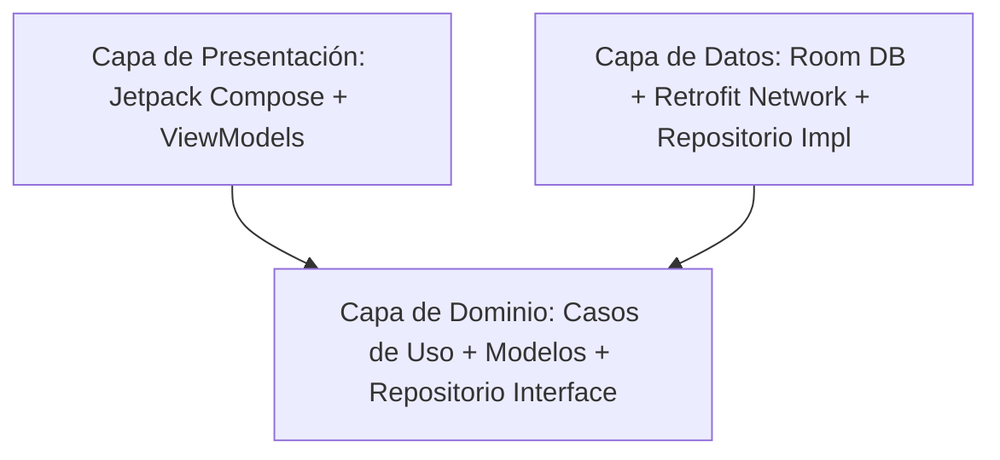

# DisneyApp - Code Challenge

## Tabla de Contenidos
- [Descripción General](#descripción-general)
- [Características y Funcionalidades](#-características-y-funcionalidades)
- [Diseño de Interfaz (UI/UX) y Concepto Visual](#-diseño-de-interfaz-uiux-y-concepto-visual)
- [Arquitectura y Decisiones de Ingeniería](#-arquitectura-y-decisiones-de-ingeniería)
- [Tecnologías Utilizadas](#-tecnologías-utilizadas)
- [Estrategia de Testing](#-estrategia-de-testing)
- [Instalación y Configuración](#-instalación-y-configuración)
- [Desarrollo Asistido por Inteligencia Artificial (IA)](#-desarrollo-asistido-por-inteligencia-artificial-ia)
- [Versionado y Flujo de Trabajo (GitFlow)](#-versionado-y-flujo-de-trabajo-gitflow)

---


---

## Descripción General

**DisneyApp** es una aplicación móvil nativa para Android diseñada para explorar y coleccionar personajes del universo Disney. Consume la API REST pública oficial de Disney ("https://disneyapi.dev/") para obtener información detallada sobre películas, cortometrajes, programas de televisión y videojuegos en los que aparece cada personaje.

Este proyecto fue desarrollado como parte de un desafío técnico en un proceso de selección para un puesto de Software Engineer Mobile. Su principal objetivo es demostrar la aplicación de buenas prácticas de programación, el diseño de arquitecturas robustas y limpias, y la creación de una interfaz de usuario interactiva y fluida utilizando componentes modernos en Android.
Por limitaciones de hardware (no disponer de sistema MacOS ni IOS a disposición) se optó por crear una app Android Nativa en Kotlin.

### Elección de la API de Disney
Se seleccionó específicamente la API de Disney para este proyecto debido a las siguientes ventajas que facilitan un desarrollo transparente y ágil:
- **Acceso Público Directo**: No requiere registro ni autenticación mediante tokens o claves, lo que simplifica su prueba y despliegue.
- **Volumen y Calidad de Datos**: Cuenta con una cantidad sustancial de registros (personajes, películas, juegos) ideal para implementar patrones como la paginación y el renderizado adaptativo.
- **Filtrado Integrado**: Su capacidad nativa para refinar resultados (por nombre, película, videojuego, etc.) resulta perfecta para demostrar cómo diseño de manera robusta la integración de estos parámetros de red con una interfaz reactiva.
- **Sencillez Arquitectónica**: Su estructura JSON plana y sin complicaciones me permite evidenciar con mayor claridad mi proceso desde cero a la hora de modelar datos y construir la aplicación.

---

## Características y Funcionalidades

La aplicación incluye las siguientes características y flujos interactivos de usuario:

### 1. Pantalla de Bienvenida (Splash Screen)
- Pantalla inicial a pantalla completa que presenta el logo de la aplicación en fondo de color corporativo de la marca.
- Transición fluida automática de **1000ms** hacia la pantalla principal de exploración de personajes.

### 2. Explorador de Personajes (Characters Screen)
- **Barra de Búsqueda Integrada**: Permite buscar personajes por nombre. La búsqueda se ejecuta explícitamente mediante la acción del teclado del sistema (`ImeAction.Search`), optimizando el consumo de red de la API. Cuenta con un botón rápido para limpiar el texto y restablecer la lista.
- **Filtro por Categorías**: Fila horizontal scrollable compuesta por Chips interactivos que permite filtrar instantáneamente los personajes según sus apariciones en:
  - *Películas* (Film)
  - *Series de TV* (TV Show)
  - *Cortometrajes* (Short Film)
  - *Videojuegos* (Video Game)
  - *Todos* (resetea el filtro)
- **Carga Infinita (Paginación)**: Integración de scroll infinito reactivo en una grilla adaptable (`GridCells.Adaptive(340.dp)`). Muestra un indicador de carga discreto al final de la lista al realizar peticiones de páginas adicionales a la API.

### 3. Gestión de Favoritos Offline (Favorites Screen)
- **Persistencia Local y Funcionamiento Offline**: El usuario puede marcar personajes como favoritos. Esta selección se almacena de manera persistente en la base de datos local (Room).
- **Acceso en Modo Desconectado**: La sección de favoritos funciona al **100% offline**, cargando los datos directamente de la base de datos local y mostrando al usuario sus personajes preferidos de forma inmediata incluso sin conexión a internet.
- **Barra de Búsqueda Local**: Barra de búsqueda optimizada para filtrar rápidamente la colección local de favoritos en base al nombre ingresado.
- **Micro-interacciones y Animaciones**:
  - **Efecto de escala elástica ("pop")**: Animación con especificación de resorte aplicada al pulsar el botón del corazón, brindando un feedback táctil agradable al usuario.
  - **Animación de Remoción Fluida**: Al quitar un favorito, la tarjeta realiza una transición que combina desvanecimiento (`fadeOut`) y encogimiento vertical (`shrinkVertically`) usando `AnimatedVisibility`, simulando una disolución fluida del elemento dentro de la grilla.
  - **Deshacer Acción (Undo)**: Al eliminar un favorito, se ofrece un snackbar interactivo con opción de reincorporar rápidamente el elemento.

### 4. Detalle del Personaje (Detail Screen)
- **Vista Hero**: Imagen representativa del personaje en alta definición con un escalado elegante.
- **Renderizado Condicional**: Sección detallada ("Aparece en:") organizada por tipo de medio (Cortometrajes, Películas, Series de TV, Videojuegos). Si un personaje no tiene registros en una categoría específica, esa sección completa es omitida dinámicamente de la interfaz para mantener la UI limpia.

### 5. Navegación Adaptativa
- Utiliza la API de `NavigationSuiteScaffold` de Material 3. La interfaz se adapta automáticamente según las dimensiones de la pantalla del dispositivo:
  - Muestra una barra de navegación inferior en dispositivos móviles pequeños.
  - Se transforma automáticamente en un riel o panel lateral de navegación en pantallas expandidas (tabletas y dispositivos plegables).

### 6. Manejo de Errores y UX Limpia
- **Abstracción Técnica**: Todos los fallos de red (timeouts, ausencia de conexión o errores HTTP) son interceptados en la capa de datos/repositorio y traducidos a estados de interfaz (UI States) semánticos y amigables. No se exponen códigos de error crudos (ej. "Error 404" o "500 Internal Server Error") ni rastros (logs) técnicos al usuario final.
- **Recuperación Intuitiva**: Ante un fallo, la interfaz presenta un mensaje claro en lenguaje natural (ej. "Sin conexión a internet, revisa tu conexión y vuelve a intentarlo"), acompañado sistemáticamente de un botón para "Reintentar", permitiendo al usuario reanudar el flujo de navegación sin frustración.

---

## Diseño de Interfaz (UI/UX) y Concepto Visual

El diseño visual de DisneyApp, denominado **"Magic Archives"**, está estructurado para inspirar nostalgia cinematográfica, magia y claridad visual.

### Identidad de Marca y Gama Cromática (Celestes/Azules)
- **El Porqué del Azul/Celeste**: Se eligió la gama de los azules y celestes (encabezada por el color **Disney Celestial Blue** - `#238EC1` en las acciones principales) como una referencia directa al icónico color de identidad de la corporación Disney. Evoca el mítico castillo de Cenicienta en las intros cinematográficas, el cielo nocturno estrellado de la magia de las hadas madrinas y una sensación general de encanto y fantasía que conecta directamente con el imaginario infantil y adulto de la franquicia.
- **Ambiente de Alto Contraste**: El fondo de la aplicación es blanco puro (`#FFFFFF`) con tarjetas en tonos grises muy suaves. Esto proporciona un entorno limpio que permite que las ilustraciones de los personajes (que suelen ser extremadamente coloridas) se conviertan en las auténticas protagonistas visuales.
- **Accesibilidad Visual**: Los chips de categorías utilizan combinaciones personalizadas de fondos pastel muy suaves con texto muy oscuro del mismo matiz cromático (por ejemplo, verde pastel y texto verde oscuro para cortometrajes). Esto asegura el cumplimiento de las pautas de accesibilidad en contraste visual (alto contraste) y facilita su distinción de un solo vistazo.
- **Tipografía**: Se utiliza la fuente geométrica **Plus Jakarta Sans** con un sistema jerárquico estricto y un color de texto gris carbón oscuro (`#1A1A1A`), el cual reduce la fatiga visual en comparación con el negro puro.

---

## Arquitectura y Decisiones de Ingeniería

El proyecto está diseñado bajo los principios de **Clean Architecture** estructurado en capas junto con el patrón **MVVM (Model-View-ViewModel)**.



### Capas del Proyecto
- **Capa de Dominio (`domain/`)**: Contiene los modelos de negocio independientes y los casos de uso (`UseCases`). Es el núcleo puro de la aplicación, libre de dependencias de frameworks externos o librerías de UI.
- **Capa de Datos (`data/`)**: Gestiona la fuente de datos. Implementa el patrón Repositorio y decide si consumir desde la API de red (`data/network`) mediante Retrofit2 o desde la persistencia de base de datos local (`data/local`) usando Room.
- **Capa de Presentación (`presentation/`)**: Gestiona el renderizado de la UI reactiva declarativa con Jetpack Compose y retiene el estado de las pantallas mediante ViewModels de ciclo de vida seguro.

### Decisiones Técnicas Clave
1. **Garantía en Dominio (Sealed Classes para Filtros)**: La API REST de Disney tiene la limitación de solo poder evaluar un criterio de búsqueda/filtro a la vez en su endpoint `GET /character`. Para evitar errores humanos en tiempo de desarrollo y asegurar la consistencia del contrato, se diseñó la jerarquía `CharacterFilter` como una clase sellada (`sealed class`). De esta forma, el compilador impide construir solicitudes con filtros vacíos o incompatibles simultáneamente.
2. **Modularización Interna**: Separación rigurosa de paquetes para facilitar el mantenimiento y la escalabilidad del software en el futuro.
3. **Inyección de Dependencias**: Uso de Dagger Hilt para desacoplar el ciclo de vida de los componentes y simplificar el testeo mediante la inyección de dobles de prueba (mocks).

---

## Tecnologías Utilizadas

- **Lenguaje**: Kotlin 2.2.10
- **Diseño de Interfaz**: Jetpack Compose (Material 3 Adaptive & Navigation Suite)
- **Inyección de Dependencias**: Dagger Hilt 2.56.1
- **Consumo de APIs (Red)**: Retrofit2 2.11.0 + Moshi 1.15.2 (para serialización segura en Kotlin)
- **Base de Datos Local**: Room 2.6.1 (con corrutinas y Flow para flujos reactivos offline)
- **Procesamiento Asíncrono**: Kotlin Coroutines & Flow (gestión de concurrencia estructurada)
- **Carga de Imágenes**: Coil 2.6.0 (carga adaptativa y en segundo plano con almacenamiento en caché)
- **Testing**: JUnit 4 & Mockk

---

## Estrategia de Testing

El proyecto cuenta con una sólida base de pruebas unitarias enfocada en garantizar la robustez de las reglas de negocio y los estados de la interfaz de usuario de manera aislada (Single Responsibility Principle aplicado a los tests):

- **Pruebas de Presentación (`FavoritesViewModelTest` y `CharactersViewModelTest`)**: Validan que los flujos de estados (`UiState`) se publiquen correctamente al cargar la información, cambiar filtros o buscar personajes.
- **Pruebas de Casos de Uso (`UseCases`)**: Pruebas unitarias que aseguran la correcta orquestación de la lógica del negocio (ej. `ToggleFavoriteUseCaseTest`, `GetCharactersUseCaseTest`, etc.).
- **Pruebas de Repositorio (`CharacterRepositoryImplTest`)**: Verifican que la capa de datos filtre correctamente y sincronice de manera adecuada entre el backend remoto de la API y la persistencia local de la base de datos de Room.
- **Pruebas de Mapeo (`CharacterMapperTest`)**: Validan la correcta transformación de objetos de red (DTOs) a las entidades internas del dominio de negocio.

---

## Instalación y Configuración

Sigue estos pasos para compilar y ejecutar el proyecto localmente en tu máquina:

1. **Clonar el repositorio**:
   ```bash
   git clone https://github.com/TolozaLeo/AranguriApps-code-challenge.git
   ```
2. **Abrir en Android Studio**:
   Abre Android Studio (se recomienda la última versión estable) y selecciona la opción "Open" para importar el directorio raíz del proyecto.
3. **Conexión de red**:
   Asegúrate de contar con conexión a internet para la descarga inicial de las dependencias definidas en el catálogo Gradle (`libs.versions.toml`).
4. **Ejecutar la aplicación**:
   Conecta un dispositivo físico Android (con depuración USB habilitada) o inicia un emulador (con API mínima 31 o superior) y presiona el botón **Run** (`Shift + F10`) en Android Studio.

> [!NOTE]
> Dado que la API pública de Disney no requiere autenticación ni tokens, **no es necesario** configurar claves privadas en el archivo `local.properties`. La aplicación iniciará y descargará los datos remotos de inmediato.

---

## Desarrollo Asistido por Inteligencia Artificial (IA)

Este proyecto integró herramientas avanzadas de IA para potenciar la productividad y asegurar el cumplimiento de estrictos estándares de ingeniería:
- **Agente Principal**: Se utilizó **Gemini Antigravity** como agente copiloto de codificación.
- **Android Skills**: Se integraron "skills" extendidas extraídas del repositorio oficial de Google ([github.com/android/skills](https://github.com/android/skills)) para estandarizar procesos y tareas de desarrollo en Android.
- **Directrices y Restricciones Estrictas**: El comportamiento del agente IA fue regulado mediante reglas innegociables de calidad. Se estableció la obligatoriedad de seguir los principios Clean Code, SOLID y documentar mediante KDoc. Adicionalmente, se fijaron restricciones claras de modificaciones: la IA tenía **prohibido** emplear "hacks" (para saltearse tests), alterar lógica *core* de negocio o introducir nuevas dependencias/librerías sin consentimiento explícito, garantizando un control total sobre la arquitectura de la aplicación.

---

## Versionado y Flujo de Trabajo (GitFlow)

Para el control de versiones y el almacenamiento del código fuente se utilizó **GitHub**, apoyándose en la metodología **GitFlow**. Este enfoque garantiza una evolución controlada y estructurada del proyecto.

- **Trazabilidad y Transparencia**: El historial completo de *Pull Requests* se mantiene vigente en el repositorio.
- **Revisión del Proceso**: Esto permite explorar de forma abierta cómo fue el flujo de trabajo, la integración de cada característica (*feature*) y las iteraciones incrementales hasta llegar a la versión final de la aplicación.
- **Historial de commit**: En cada pull request se optó por usar la opción "squash and merge" de github para mantener limpio y compacto el flujo de la rama principal **Develop**; el historial de commits completo está disponible en cada rama creada.

---

<br/>
<div align="center">
  <b>Leonardo Toloza - Software Engineer Mobile</b>
  <br/>
  <b>https://www.linkedin.com/in/tolozaleo/</b>
</div>
